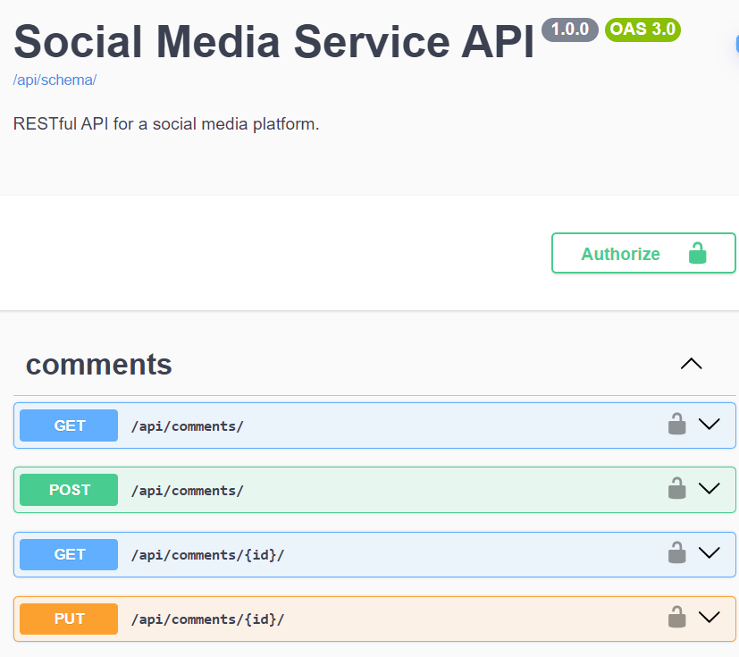

# Social Media API Service
RESTful API for a social media platform.

The API allows users to create profiles, follow other users, create and retrieve posts, 
manage likes and comments, and perform basic social media actions.
___

### Database Structure:


### Features:

- User Registration and Authentication with email and password
- JWT Authentication, Login and Logout
 #### Managing User Profiles
- User Profile includes profile picture, bio and other details
- Searching for users by email or full name 
- Follow / Unfollow other users
- List of the followers and List of that followed by them
#### Managing Posts and Comments
- Post contains text content, image
- Searching posts by hashtags
- Like / Unlike posts, List of liked posts
- List of comments
- Schedule Post creation with specified date
#### Permissions
- Access only for authenticated users 
- Update & Delete only own users profile, posts, comments 
#### Admin panel :
- /admin/
#### Documentation : 
- through Swagger-UI

___
### System requirements & Technologies :

* **Python 3.12+ (need to be installed locally)**
####
* Django 5.+ 
* Django Rest Framework (DRF) 3.+ 
* Celery
* Flower (monitoring for Celery)
* drf spectacular (documentation)

---
### Installation using GitHub

1. Clone GitHub repository:
```
https://github.com/u123dev/social_media_api
```
  - You can get the link by clicking the `Clone or download` button in your repo

2. Open the project folder in your IDE

or 
```
cd social_media_api
```
3. Make virtual environment and install requirements in it:
```
py -m venv venv
venv\Scripts\activate (on Windows)
# or
source venv/bin/activate (on macOS)
pip install -r requirements.txt
```
4. DATABASE:
- a) You need to Install **PostgreSQL**

Create environment variables (or specify in .env file): 
```
set POSTGRES_DB = <db name>
set POSTGRES_USER = <db username>
set POSTGRES_PASSWORD = <db user password>
set POSTGRES_HOST = <db host>
set POSTGRES_PORT = <db port>
```
or 
- b) You can use built-in SQlite by default

5. Migrate & make database:
```
py manage.py migrate
```
6. To create demo admin user:
```
py manage.py init_superuser
```
7. Run Redis Server: 
```
docker run -d -p 6379:6379 redis
```
8. Run Celery Worker: 
```
celery -A social_media_api worker -l info
```
or 
```
celery -A social_media_api worker -l info --pool=solo
```
9. Run Flower (Celery monitoring):
```
py -m celery -A social_media_api flower
```
10. Run Project:
```
py manage.py runserver
```
 
---

### Run with Docker 
 System requirements:

* **Docker Desktop 4.+**

Run project:
```
docker-compose up --build
```

### Getting access:
1. Access API Service in browser:
[http://127.0.0.1:8000/api/](http://127.0.0.1:8000/api/)


2. Access Flower / Celery tasks monitoring:
[http://127.0.0.1:5555/tasks/](http://127.0.0.1:8000/5555/tasks/)


3. Admin panel:
[http://127.0.0.1:8000/admin/](http://127.0.0.1:8000/admin/)


4. After loading init data you can use demo admin user:
  - Email (as Login): `admin@email.com`
  - Password: `admin`

5. Register new user:
- **api/user/register/** 

6. Obtain pair an access authentication & refresh tokens by sending a POST user credentials - email(as login) & password: 
- **api/user/token/** 

7. Header to access endpoints:
- **Authorization: Bearer *< Access Token >***

### Documentation 
 
Swagger via:
- **api/schema/swagger-ui/** 

Redoc via:
- **api/doc/redoc/**

### Demo




### Contact
Feel free to contact: u123@ua.fm
